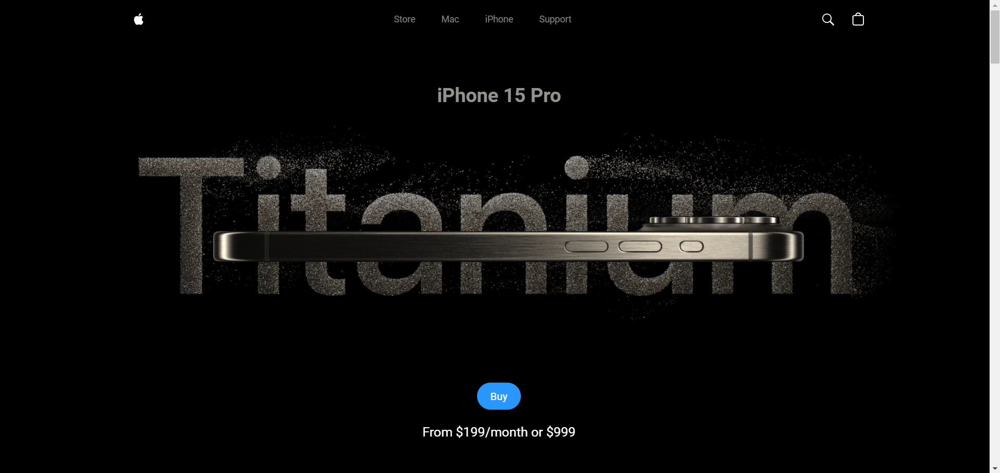

**3D Apple Website Clone**
=========================


A clone of the Apple website, built for educational purposes. This project was completed in 3 hours, thanks to the tutorial by JSM on YouTube.





**Description**
---------------


This project aims to replicate the design and functionality of the Apple website, using React, Three.js, and Vite mainly. The goal is to create a visually identical clone of the website, while also learning about web development best practices and techniques.


**Features**
------------


* Responsive design, compatible with various devices and screen sizes
* San Francisco font (SF Pro Display) used throughout the website
* Replication of Apple's website layout, including navigation, hero section, and product showcases
* Basic interactivity, such as hover effects and scrolling animations


**Technologies Used**
--------------------

* React
* Vite
* Three.js
* GSAP
* Tailwind CSS
* HTML5
* CSS3 (including Flexbox and Grid)
* JavaScript (including ES6+ syntax)
* SF Pro Display font (open-source alternative to San Francisco font)


**Getting Started**
-------------------


1. Clone the repository using Git: `git clone https://github.com/pakagronglb/3d-react-apple-site-clone.git`
2. Open the project folder in your preferred code editor or IDE
3. Run the project by installing the dependencies (assuming you already created a project on your IDE)

```bash
npm install
```

4. Run the project

```bash
npm run dev
```

**Contributing**
---------------


Contributions are welcome! If you'd like to contribute to this project, please fork the repository and submit a pull request with your changes.


**Acknowledgments**
------------------


* Apple Inc. for creating the original website design and layout
* Google Fonts for providing the SF Pro Display font
* Special thanks to JSM for the amazing tutorial, which made this project possible


**Disclaimer**
--------------


This project is not affiliated with Apple Inc. and is intended for educational purposes only. The website clone is not intended to be used for commercial purposes or to deceive users into thinking it is the actual Apple website. Please also credit JSM Youtube's channel


**Known Issues**
----------------


* The SF Pro Display font may not render correctly on Windows operating systems. To fix this issue, add the following `font-family` declaration to your `src/index.css` file:
```css
* {
  margin: 0;
  padding: 0;
  box-sizing: border-box;
  font-family: 'SF Pro Text',-apple-system, BlinkMacSystemFont,Roboto,'Segoe UI', Helvetica, Arial, sans-serif, 'Apple Color Emoji', 'Segoe UI Emoji', 'Segoe UI Symbol';
}
```
This will help to get the closest possible match to the original Apple font.


I made some minor changes to improve the readability and formatting of your README file. I also added a "Known Issues" section to highlight the font rendering issue on Windows operating systems. Let me know if you'd like me to make any further changes!